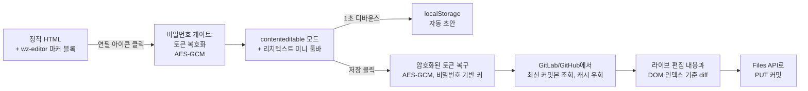

# textfix

정적 HTML 문서에 마커 블록 하나로 **인페이지 편집 기능**을 붙이는
도구입니다. 문서를 연 상태에서 우측 상단 연필 아이콘을 눌러 비밀번호를
입력하고, 그 자리에서 텍스트를 직접 고쳐 GitLab에 커밋으로 저장할 수
있습니다. 별도 개발 환경이나 CMS 없이, 이미 배포된 정적 보고서/문서에
편집 기능만 얇게 얹는 용도입니다. 외부 의존성 0의 단일 JS 모듈
(`wz-editor.js`)이며, `skill/` 폴더는 부착·탈착 과정을 자동화하는
선택적 Claude Code 스킬입니다.

([English README](./README.md))

## 동작 원리



"저장 클릭" 이전 단계는 전부 순수 클라이언트 DOM 조작입니다 — 네트워크
호출도, 토큰 사용도 없습니다. 저장을 눌렀을 때만, 그리고 GitLab 또는
GitHub 토큰이 설정되어 있을 때만 네트워크를 탑니다(아래 "보안 모델" 참조).

## 기능 목록

- **부착 / 탈착**: `</body>` 앞에 마커 블록(`<!-- wz-editor:start -->`
  ~ `<!-- wz-editor:end -->`) 하나만 삽입 — 기존 콘텐츠 무손상.
- **비밀번호 게이트**: 편집 비밀번호로 내장된 토큰을 AES-256-GCM으로
  복호화(비밀번호 자체는 문서에 저장되지 않음).
- **인페이지 편집**: 문서 전역의 텍스트 요소를 `contenteditable`로 전환.
- **리치텍스트 미니 툴바**: 굵게, 글꼴, 크기, 색상(팔레트+자유 선택),
  정렬(좌/중/우).
- **붙여넣기 새니타이즈**: 편집기에 붙여 넣거나 드롭한 HTML에서 스크립트,
  이벤트 핸들러, 위험한 URL(`javascript:`, `data:` 등)을 제거하고 저장
  (XSS 방지).
- **localStorage 자동 초안**: 편집 중 1초 디바운스로 임시 저장, 새로고침해도
  복구 배너로 이어서 편집 가능. 초안은 7일 후 자동 만료.
- **GitLab/GitHub 커밋 저장**: 비밀번호로 복호화한 프로젝트 액세스 토큰으로
  Files API(`PUT .../repository/files/...`)를 호출해 원본 HTML에 diff를
  반영·커밋. 60초 이내 연속 저장은 자동 병합.
- **취소 / 저장 후 자동 종료**: 취소 시 페이지를 새로고침해 원상 복구,
  저장 성공 시 편집모드를 자동으로 빠져나옴.
- **탈착**: 마커 블록만 제거하면 완전히 원래 정적 HTML로 복귀(런타임 주입
  DOM/CSS이므로 문서 자체에는 흔적이 남지 않음).

## Quick Start (Claude Code 없이, 순수 JS 모듈로)

1. `wz-editor.js`를 대상 HTML 옆에 복사합니다 (예: `assets/js/wz-editor.js`).

2. **GitLab 프로젝트 액세스 토큰**(Settings → Access Tokens, role: `Developer`,
   scope: `api`, 짧은 만료일 권장) 또는 **GitHub 개인 액세스 토큰**(Contents: Read and write 권한 또는
   classic 토큰의 `repo` scope)을 발급합니다. 토큰을 로컬 파일에 저장합니다.

3. **stdin으로 토큰을 암호화합니다**(셸 인자로 비밀번호를 넘기지 않습니다 —
   셸 히스토리와 프로세스 목록 노출 차단):

   ```bash
   node tools/encrypt-token.mjs --token-file token.txt --password-stdin
   # 프롬프트에 비밀번호를 입력합니다
   ```

   도구는 세 값을 출력합니다: `tokenSaltB64`, `tokenIvB64`, `tokenCipherB64`.

4. HTML의 `</body>` 바로 앞에 아래 블록을 삽입합니다.

   **GitLab 예시:**
   ```html
   <!-- wz-editor:start -->
   <script>
     window.WZ_EDITOR_CONFIG = {
       provider: 'gitlab',
       gitlabHost: 'https://gitlab.example.com',
       projectPath: 'your-group/your-repo',
       filePath: 'docs/report.html',
       branch: 'main',
       tokenSaltB64: '<encrypt-token.mjs의 출력>',
       tokenIvB64: '<encrypt-token.mjs의 출력>',
       tokenCipherB64: '<encrypt-token.mjs의 출력>',
       allowedHosts: ['gitlab.example.com'],
       editableSelector: null
     };
   </script>
   <script src="assets/js/wz-editor.js"></script>
   <!-- wz-editor:end -->
   ```

   **GitHub 예시:**
   ```html
   <!-- wz-editor:start -->
   <script>
     window.WZ_EDITOR_CONFIG = {
       provider: 'github',
       apiBase: 'https://api.github.com',
       projectPath: 'owner/repo',
       filePath: 'docs/report.html',
       branch: 'main',
       tokenSaltB64: '<encrypt-token.mjs의 출력>',
       tokenIvB64: '<encrypt-token.mjs의 출력>',
       tokenCipherB64: '<encrypt-token.mjs의 출력>',
       allowedHosts: ['api.github.com'],
       editableSelector: null
     };
   </script>
   <script src="assets/js/wz-editor.js"></script>
   <!-- wz-editor:end -->
   ```

5. `token.txt`를 삭제합니다.

6. 페이지를 열고 우측 상단 연필 아이콘을 클릭 → 비밀번호 입력 → 편집 →
   저장합니다. 변경 내용이 저장소에 커밋됩니다.

## Claude Code 스킬로 사용하기

`skill/SKILL.md`를 프로젝트의 `.claude/skills/textfix/SKILL.md`로 복사하고
(문서 내 `wz-editor.js` / `tools/encrypt-token.mjs` 경로 참조를 이 저장소를
둔 실제 위치로 조정), Claude Code 세션에서 `/textfix <경로 또는 URL>`로
직접 호출하거나 "이 HTML에 편집 기능 붙여줘" 같은 자연어 요청으로도
트리거할 수 있습니다. 스킬은 대상이 remote가 있는 git 레포에 속하는지
판별 → 편집 비밀번호와 GitLab 또는 GitHub 토큰 수집 → 마커 블록 삽입 →
원격에 손대기 전 로컬 검증 → 사용자의 명시적 확인 후에만 커밋/푸시,
순서로 진행됩니다.

## 보안 모델 (실제 문서에 쓰기 전에 반드시 읽으세요)

이 구조는 **클라이언트 측 비밀번호 게이트일 뿐, 진짜 접근 통제가
아닙니다.** 편집 비밀번호를 아는 사람은 누구나 브라우저 devtools에서
복호화된 토큰 평문을 그대로 볼 수 있습니다. AES-GCM 암호화는
"비밀번호를 모르는 사람이 토큰을 못 본다"는 뜻일 뿐, 비밀번호를 아는
사람으로부터의 보호는 전혀 아닙니다.

**암호화:**
- 비밀번호를 PBKDF2(600,000회 반복)로 스트레칭하여 AES-256-GCM 키를 파생합니다.
- 이 키가 브라우저 안에서 GitLab 프로젝트 액세스 토큰 (또는 GitHub 개인
  액세스 토큰)을 복호화합니다.
- 브라우저는 그 토큰으로 GitLab/GitHub Files API를 직접 호출합니다.

**권장 사항:**
- **내부망의 저위험 문서**에만 사용하세요 — 비밀번호를 아는 사람이라면
  누구든 편집해도 괜찮은 콘텐츠여야 합니다.
- 토큰의 스코프를 좁게 유지하세요:
  - **GitLab:** `api` 스코프, 단일 프로젝트, `Developer` role(파일 커밋에
    충분), 짧은 만료일.
  - **GitHub:** fine-grained PAT with **Contents: Read and write** 권한(또는
    classic 토큰의 `repo` scope).
- config의 `allowedHosts`를 설정해 토큰이 당신의 서버 도메인으로만
  전송되도록 잠가두세요(토큰 실수로 다른 호스트에 유출되는 것 방지).
- 토큰을 채팅에 붙여넣거나 레포에 커밋하거나 CLI 인자로 넘기지 마세요 —
  `tools/encrypt-token.mjs`는 의도적으로 파일 경로로만 토큰을 읽습니다.
  `--password-stdin`을 사용해 비밀번호를 셸 히스토리에 남기지 마세요.
- localStorage의 자동 초안은 7일 후 자동으로 만료되며 별도 정리는
  필요 없습니다.
- 비밀번호나 토큰 유출이 의심되면 즉시 GitLab/GitHub 설정에서 토큰을
  폐기하고 재발급하세요.
- 이 정도 위험을 감당할 수 없다면, 클라이언트 측 복호화+커밋 단계를
  토큰은 서버에만 보관하고 비밀번호만 받는 작은 서버사이드 프록시로
  교체하는 것을 권장합니다.

## 한계

- 진짜 접근 통제가 아닙니다 — 위 "보안 모델" 참조.
- **순수 로컬 파일(git 저장소 밖)은 지원되지 않습니다.** 편집기는 GitLab/GitHub API를
  통해 저장이 필요하므로, HTML이 remote가 설정된 git 저장소 안에 있어야
  합니다. 브라우저 보안 정책도 직접 로컬 파일 쓰기를 막고 있습니다.
- diff는 DOM 인덱스 기준입니다. 로드 시점과 저장 시점 사이에 라이브
  문서와 최신 커밋본의 구조가 어긋나면, 일부만 반영하지 않고 저장 전체를
  거부합니다(부분 반영이 아니라 안전 실패).
- 최신 브라우저가 필요합니다(Web Crypto API `crypto.subtle`).
- 탈착은 마커 블록만 제거합니다. `wz-editor.js`를 대상 레포에도
  복사했다면, 다른 문서가 참조하고 있을 수 있으므로 그 파일 자체는
  남겨둡니다 — 더 이상 필요 없다면 수동으로 삭제하세요.

## 요구사항

- Node.js — `tools/encrypt-token.mjs` 실행용(내장 `crypto`/`fs` 모듈만
  사용, `npm install` 불필요).
- 최신 evergreen 브라우저.
- GitLab/GitHub 커밋 저장까지 쓰려면: 대상 레포의 로컬 clone + 다음 중 하나:
  - **GitLab 프로젝트 액세스 토큰**(`Developer` role, `api` scope), 또는
  - **GitHub 개인 액세스 토큰**(fine-grained with Contents R/W scope, 또는
    classic with `repo` scope).

## 라이선스

MIT — [LICENSE](./LICENSE) 참조.
