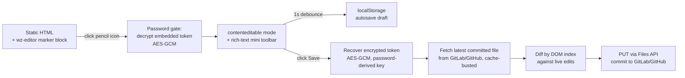

# textfix

In-page editing for static HTML documents, attached with a single marker
block. Open a static report or dashboard in the browser, click the pencil
icon, enter a password, edit the text right there, and save straight to a
GitLab commit — no build step, no CMS, no separate editor app. It's a
single-file JS module (`wz-editor.js`) with zero dependencies; the
`skill/` folder is an optional Claude Code skill that automates attaching
and detaching it.

([한국어 문서](./README.ko.md))

## How it works



Everything left of the "click Save" step is pure client-side DOM
manipulation — no network calls, no token involved. Only pressing Save
touches the network, and only if a GitLab or GitHub token was configured
(see Security model below).

## Features

- **Attach / detach** via a single marker block
  (`<!-- wz-editor:start -->` … `<!-- wz-editor:end -->`) inserted before
  `</body>` — existing content is left untouched.
- **Universal editing by default** — every element that holds visible text
  becomes editable automatically; there's no per-document selector to write
  or maintain. It only skips its own UI chrome and non-visual containers
  (`script`/`style`/`template`). Set `editableSelector` in the config to a
  CSS selector if you want to restrict editing to a hand-picked set of
  elements instead (opt-in, advanced).
- **Password gate** — the edit password decrypts an embedded token using
  AES-256-GCM; the password itself is never stored in the document.
- **In-page editing** — turns matched text elements into `contenteditable`
  regions.
- **Rich-text mini toolbar** — bold, font family, size, color (palette +
  free picker), alignment (left/center/right).
- **Paste sanitization** — HTML pasted or dropped into the editor has
  scripts, event handlers, and dangerous URLs (`javascript:`, `data:` etc.)
  stripped before saving (XSS prevention).
- **localStorage autosave draft** — 1-second debounce while editing, with a
  recovery banner on reload so you don't lose work. Drafts auto-expire after
  7 days.
- **GitLab/GitHub commit save** — decrypts an embedded project access token
  with the edit password, then calls the Files API (`PUT .../repository/files/...`) 
  to commit the diff. Saves within a 60-second window auto-merge instead of racing.
- **Deploy-tracking status banner** — after a successful save, a banner
  tracks the commit from "deploying" through to "live" by polling the
  GitLab pipeline status or GitHub commit status API, so you know when the
  change has actually gone out (not just that the commit landed). Polling
  stops as soon as success/failure is confirmed, or once its attempt budget
  runs out; a network hiccup degrades to "pending" rather than throwing, so
  it never blocks editing.
- **Stale re-edit guard** — if you re-enter edit mode on the same document
  while your last save is still confirmed pending deployment (within the
  last 15 minutes), you get a heads-up before you start editing on top of a
  change that hasn't gone live yet.
- **Cancel / auto-exit on save** — Cancel reloads the page to discard
  changes; a successful save automatically exits edit mode.
- **Clean detach** — everything the module renders is injected at runtime,
  so removing the marker block alone fully restores the original static
  document.

## Setup (once per repo) vs. daily use

Steps 1-5 below are a **one-time setup per document/repo**: generate a
token, encrypt it, embed it. Once that's done, day-to-day editing needs
only the page URL and the edit password — nobody has to touch a token
again until it expires or you rotate it.

## Quick Start (plain JS module — no Claude Code required)

1. Copy `wz-editor.js` next to your HTML, e.g. as `assets/js/wz-editor.js`.

2. Generate a write token:
   - **GitLab Project Access Token** (Settings → Access Tokens). If the
     target branch (usually `main`) is a **protected branch**, the role
     must be **Maintainer** — a `Developer` token fails at save time with
     `400 You are not allowed to push into this branch` (confirmed against
     a real protected-branch project). If the branch isn't protected,
     `Developer` also works, but `Maintainer` is still recommended. Scope:
     **`api` only** — saving goes through the REST API
     (`/repository/files`, `/commits`), which needs `api`;
     `write_repository` (git-over-HTTP only) doesn't help here. A short
     expiration is recommended.
   - **GitHub fine-grained Personal Access Token**, scoped to the target
     repo, with **Contents: Read and write** (or a classic token with the
     `repo` scope).

   Save the token to a local file (e.g. `token.txt`) — or, if you'll be
   attaching this to more than one document, set it as an OS environment
   variable instead (e.g. `TEXTFIX_TOKEN` on Windows via
   `setx TEXTFIX_TOKEN "<token>"`, opening a new terminal afterward) so you
   don't have to re-fetch it from GitLab/GitHub settings for every document
   you attach.

3. Encrypt the token with your chosen edit password using **stdin** (not shell args):

   ```bash
   # from a file:
   node tools/encrypt-token.mjs --token-file token.txt --password-stdin
   # ...or from an environment variable (only the variable NAME goes on argv,
   # the script reads the value from process.env itself):
   node tools/encrypt-token.mjs --token-env TEXTFIX_TOKEN --password-stdin
   # Then type your password when prompted
   ```

   This avoids exposing the password (or the token itself) in shell history
   or process lists. The tool outputs three values: `tokenSaltB64`,
   `tokenIvB64`, `tokenCipherB64`.

4. Insert this block right before `</body>` in your HTML:

   **GitLab example:**
   ```html
   <!-- wz-editor:start -->
   <script>
     window.WZ_EDITOR_CONFIG = {
       provider: 'gitlab',
       gitlabHost: 'https://gitlab.example.com',
       projectPath: 'your-group/your-repo',
       filePath: 'docs/report.html',
       branch: 'main',
       tokenSaltB64: '<output from encrypt-token.mjs>',
       tokenIvB64: '<output from encrypt-token.mjs>',
       tokenCipherB64: '<output from encrypt-token.mjs>',
       allowedHosts: ['https://gitlab.example.com'],
       editableSelector: null
     };
   </script>
   <script src="assets/js/wz-editor.js"></script>
   <!-- wz-editor:end -->
   ```

   🔴 `allowedHosts` must be an **origin** (`new URL(host).origin`, e.g.
   `https://gitlab.example.com`, path excluded even for GitHub Enterprise)
   — a bare hostname silently fails the check and the editor never renders
   (no pencil icon). `node tools/embed-lint.mjs <path>` catches this before
   you open a browser.

   **GitHub example:**
   ```html
   <!-- wz-editor:start -->
   <script>
     window.WZ_EDITOR_CONFIG = {
       provider: 'github',
       apiBase: 'https://api.github.com',
       projectPath: 'owner/repo',
       filePath: 'docs/report.html',
       branch: 'main',
       tokenSaltB64: '<output from encrypt-token.mjs>',
       tokenIvB64: '<output from encrypt-token.mjs>',
       tokenCipherB64: '<output from encrypt-token.mjs>',
       allowedHosts: ['https://api.github.com'],
       editableSelector: null
     };
   </script>
   <script src="assets/js/wz-editor.js"></script>
   <!-- wz-editor:end -->
   ```

5. If you used `--token-file`, delete `token.txt` after inserting the
   config. Then verify the embed before opening a browser:

   ```bash
   node tools/embed-lint.mjs path/to/your-report.html
   ```

   It checks that `tokenCipherB64` is present, the host is `https://`,
   `allowedHosts` contains that host's origin, and the `<script src>` path
   actually resolves — all four are silent failure modes otherwise (the
   pencil icon just never appears, with no error visible on the page).

6. Open the page, click the pencil icon (top-right), enter the password,
   edit, and Save. Your changes are committed directly to the repository,
   and a status banner tracks the deploy from "deploying" to "live".

## Using it as a Claude Code skill

Copy `skill/SKILL.md` into your project's `.claude/skills/textfix/SKILL.md`
(update the `wz-editor.js` / `tools/encrypt-token.mjs` path references
inside it to wherever you keep this repo), then from a Claude Code session
either run `/textfix <path-or-url>` or ask in plain language — e.g. "add
in-page editing to this HTML." The skill walks through: detecting whether
the target belongs to a git repo with a remote, collecting the edit
password and a GitLab or GitHub token, inserting the marker block,
verifying locally before touching anything remote, and only committing /
pushing after you explicitly confirm.

## Security model (read before using this on anything real)

This is a **client-side password gate, not access control.** Whoever knows
the edit password can open browser devtools and read the decrypted token in
plaintext. AES-GCM here only stops someone *without* the password from
reading the token — it does nothing against someone who has it.

**Encryption:**
- Password is stretched via PBKDF2 (600,000 iterations) into an
  AES-256-GCM key.
- This key decrypts a GitLab Project Access Token (or GitHub Personal Access
  Token) inside the browser.
- The browser then talks directly to the GitLab/GitHub Files API with the
  decrypted token.

**Best practices:**
- Use this only on **low-risk, internal-network documents** — content
  you'd be fine with anyone who has the password editing.
- Scope tokens narrowly:
  - **GitLab:** `api` scope, a single project, and a short expiration date.
    Role depends on the target branch: if it's a **protected branch**
    (typically `main`), you need **Maintainer** — `Developer` is rejected by
    GitLab at save time (`400 You are not allowed to push into this
    branch`). Lower role isn't automatically "safer" here; it's simply
    "doesn't work" against a protected branch.
  - **GitHub:** fine-grained PAT with **Contents: Read and write** scope (or
    classic token with `repo` scope).
- Set `allowedHosts` in the config to lock the token to your server's
  domain, preventing accidental token leaks to other hosts. It must be an
  **origin** (e.g. `https://gitlab.example.com`), not a bare hostname —
  `tools/embed-lint.mjs` checks this for you.
- Never paste the token into chat, commit it to a repo, or pass it as a CLI
  argument — `tools/encrypt-token.mjs` only reads it from a file path or an
  environment variable name, by design. Use `--password-stdin` to avoid
  exposing the password in shell history.
- If you suspect the password or token leaked, revoke it immediately in
  GitLab/GitHub settings.
- For anything beyond that risk tolerance, replace the client-side
  decrypt-and-commit step with a small server-side proxy that holds the
  token and only ever accepts the password from the client.

### Local data the browser keeps

Everything wz-editor writes stays in the browser's **localStorage**, scoped
to the origin the document is served from (never sent to any server, repo,
or other site). Two kinds of entries exist, both key-namespaced per
document path:

- **Draft** — the in-progress edit backup described above, so a crash or
  accidental reload doesn't lose your work before you save. Auto-expires
  after 7 days.
- **Last-save record** — one small entry per document (~100 bytes:
  `{document path, commit SHA, timestamp}`), used only to decide whether to
  warn you before re-entering edit mode on a save that hasn't finished
  deploying yet (see "Stale re-edit guard" above). It's an internal
  decision value, not something meant for you to read directly.
- The last-save record deletes itself automatically once 15 minutes have
  passed, or as soon as a newer commit is detected upstream — it never
  accumulates.
- **Neither entry ever stores the token or the edit password.**
- To clear either manually, use your browser's "Clear site data" for the
  page's origin.

### Security review evidence

Core items reviewed before release:

| Check | Method | Result |
|-------|--------|--------|
| No unauthorized document persistence | Full grep of localStorage/IndexedDB/cookie/file-write/remote-logging + source read | **PASS** |
| No external exfiltration path | Full grep of fetch/XHR/sendBeacon/WebSocket/tracking-pixel — network calls limited to the configured repo API only | **PASS** |
| Token encryption design | PBKDF2-SHA256 600,000 iterations + AES-256-GCM (random salt/IV) source read + encrypt/decrypt round-trip | **PASS** |
| Password verifier | Auth = successful token decryption (no separate password hash is published → no offline-crack surface) source read + analysis | **PASS** |

## Limitations

- No real access control — see Security model above.
- **Pure local files (outside a git repository) are not supported.** The
  editor requires saving via GitLab/GitHub API, which means the HTML must
  be in a git repository with a remote configured. Browser security policies
  prevent direct local file writes anyway.
- Diffing is DOM-index based: if the live document's structure and the
  latest committed version have drifted apart between load and save, the
  whole save is rejected rather than partially applied (fails closed, does
  not partial-write).
- Requires a modern browser (Web Crypto API, `crypto.subtle`).
- Detach only removes the marker block. If you also copied `wz-editor.js`
  into the target repo, that file itself is left in place in case other
  documents reference it — delete it manually if it's no longer needed.

## Requirements

- Node.js, for `tools/encrypt-token.mjs` — uses only the built-in
  `crypto`/`fs` modules, no `npm install` needed.
- A modern evergreen browser.
- GitLab/GitHub commit-save additionally needs a local clone of the target
  repo and either:
  - A **GitLab Project Access Token** (`Maintainer` role if the branch is
    protected, `api` scope), or
  - A **GitHub Personal Access Token** (fine-grained with Contents R/W scope,
    or classic with `repo` scope).

## License

MIT — see [LICENSE](./LICENSE).
