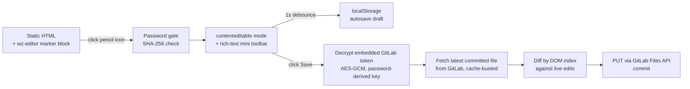

# textfix

In-page editing for static HTML documents, attached with a single marker
block. Open a static report or dashboard in the browser, click the pencil
icon, enter a password, edit the text right there, and save straight to a
GitLab commit — no build step, no CMS, no separate editor app. It's a
single-file JS module (`wz-editor.js`) with zero dependencies; the
`skill/` folder is an optional Claude Code skill that automates attaching
and detaching it.

([한국어 문서](./README.ko.md))

## How it works



Everything left of the "click Save" step is pure client-side DOM
manipulation — no network calls, no token involved. Only pressing Save
touches the network, and only if a GitLab token was configured (see
Security model below).

## Features

- **Attach / detach** via a single marker block
  (`<!-- wz-editor:start -->` … `<!-- wz-editor:end -->`) inserted before
  `</body>` — existing content is left untouched.
- **Password gate** — the edit password is checked as a SHA-256 hash; the
  plaintext password never lives in the code.
- **In-page editing** — turns the document's text elements into
  `contenteditable` regions.
- **Rich-text mini toolbar** — bold, font family, size, color (palette +
  free picker), alignment (left/center/right).
- **localStorage autosave draft** — 1-second debounce while editing, with a
  recovery banner on reload so you don't lose work.
- **GitLab commit save** — decrypts an embedded project access token with
  the edit password, then calls the GitLab Files API
  (`PUT .../repository/files/...`) to commit the diff into the original
  HTML. Saves within a 60-second window auto-merge instead of racing.
- **Cancel / auto-exit on save** — Cancel reloads the page to discard
  changes; a successful save automatically exits edit mode.
- **Clean detach** — everything the module renders is injected at runtime,
  so removing the marker block alone fully restores the original static
  document.

## Quick Start (plain JS module — no Claude Code required)

1. Copy `wz-editor.js` next to your HTML, e.g. as `assets/js/wz-editor.js`.
2. Insert this block right before `</body>`:

   ```html
   <!-- wz-editor:start -->
   <script>
     window.WZ_EDITOR_CONFIG = {
       gitlabHost: 'https://gitlab.example.com',
       projectPath: 'your-group/your-repo',
       filePath: 'docs/report.html',
       branch: 'main',
       pwHashHex: '<hex SHA-256 of your edit password>',
       tokenSaltB64: '',
       tokenIvB64: '',
       tokenCipherB64: '',
       editableSelector: null
     };
   </script>
   <script src="assets/js/wz-editor.js"></script>
   <!-- wz-editor:end -->
   ```

   Compute `pwHashHex` however is convenient — e.g. in a browser console:
   `crypto.subtle.digest('SHA-256', new TextEncoder().encode('<password>'))`,
   or with Node's `crypto` module.

3. *(Optional — enables GitLab commit-save.)* Generate a GitLab **Project
   Access Token** (Settings → Access Tokens; role `Maintainer`, scope
   `api`, short expiration recommended). Save the token to a local file —
   **never** paste it into a chat window or pass it as a shell argument —
   then run:

   ```
   node tools/encrypt-token.mjs --token-file token.txt "<your edit password>"
   ```

   Paste the three printed values (`tokenSaltB64`, `tokenIvB64`,
   `tokenCipherB64`) into the config above, then delete `token.txt`.

4. Open the page, click the pencil icon (top-right), enter the password,
   edit, and Save.

Without step 3, everything works except the actual GitLab commit — Save
shows a clearly-labeled failure toast instead. No edits are lost; they stay
on the page and in the localStorage draft until you copy them out manually
or wire up a token later. See `examples/embed-example.html` for a working
skeleton in this no-token mode.

## Using it as a Claude Code skill

Copy `skill/SKILL.md` into your project's `.claude/skills/textfix/SKILL.md`
(update the `wz-editor.js` / `tools/encrypt-token.mjs` path references
inside it to wherever you keep this repo), then from a Claude Code session
either run `/textfix <path-or-url>` or ask in plain language — e.g. "add
in-page editing to this HTML." The skill walks through: detecting whether
the target belongs to a git repo with a remote, collecting the edit
password and (optionally) a GitLab token, inserting the marker block,
verifying locally before touching anything remote, and only committing /
pushing after you explicitly confirm.

## Security model (read before using this on anything real)

This is a **client-side password gate, not access control.** Whoever knows
the edit password can open browser devtools and read the decrypted GitLab
token in plaintext. AES-GCM here only stops someone *without* the password
from reading the token — it does nothing against someone who has it.

Concretely: a password-derived AES-256-GCM key decrypts a GitLab Project
Access Token inside the browser, and the browser then talks directly to the
GitLab Files API with that token.

- Use this only on **low-risk, internal-network documents** — content
  you'd be fine with anyone who has the password editing.
- Scope the GitLab token narrowly: `api` scope, a single project,
  `Maintainer` role, and a short expiration date, so a leaked password's
  blast radius stays small.
- Never paste the token into chat, commit it to a repo, or pass it as a CLI
  argument — `tools/encrypt-token.mjs` only reads it from a file path you
  give it, by design.
- If you suspect the password or token leaked, revoke the token in GitLab
  immediately.
- For anything beyond that risk tolerance, replace the client-side
  decrypt-and-commit step with a small server-side proxy that holds the
  token and only ever accepts the password from the client.

## Limitations

- No real access control — see Security model above.
- Diffing is DOM-index based: if the live document's structure and the
  latest committed version have drifted apart between load and save, the
  whole save is rejected rather than partially applied (fails closed, does
  not partial-write).
- Requires a modern browser (Web Crypto API, `crypto.subtle`).
- Detach only removes the marker block. If you also copied `wz-editor.js`
  into the target repo, that file itself is left in place in case other
  documents reference it — delete it manually if it's no longer needed.

## Requirements

- Node.js, for `tools/encrypt-token.mjs` — uses only the built-in
  `crypto`/`fs` modules, no `npm install` needed.
- A modern evergreen browser.
- GitLab commit-save additionally needs a local clone of the target repo
  and a GitLab Project Access Token (`Maintainer` role, `api` scope).

## License

MIT — see [LICENSE](./LICENSE).
